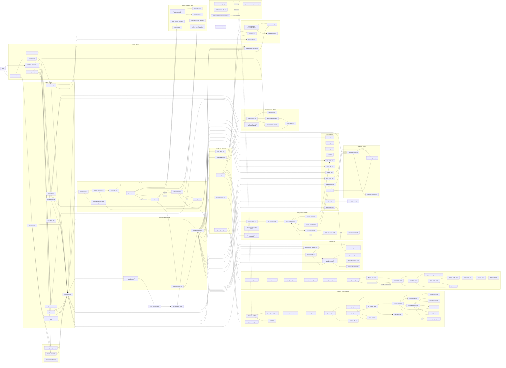

```mermaid
flowchart LR
    User["Abhi"]

    subgraph Frontend["Frontend / Browser"]
        UI["React + TypeScript UI"]
        Orb["Orb / Progress / Tool Events"]
        VoiceHook["useJarvisVoice.ts"]
        VoiceService["voiceService.ts"]
        MusicWidget["Music Player Widget"]
        TrackingView["Tracking UI / Consent Pages"]
    end

    subgraph Backend["FastAPI Runtime"]
        Main["backend/main.py"]
        WS["WebSocket /ws"]
        HealthAPI["Core REST APIs"]
        VoiceAPI["voice_routes.py"]
        MusicAPI["music/routes.py"]
        TrackingAPI["tracking/routes.py"]
        UploadAPI["/api/upload"]
        MemoryAPI["/api/memory + distill + export"]
        OAuthAPI["Google OAuth routes"]
    end

    User --> UI
    User --> VoiceHook
    User --> TrackingView
    UI --> WS
    UI --> HealthAPI
    UI --> UploadAPI
    UI --> MemoryAPI
    UI --> OAuthAPI
    VoiceHook --> VoiceService
    VoiceHook --> VoiceAPI
    MusicWidget --> MusicAPI
    TrackingView --> TrackingAPI
    WS --> Main
    HealthAPI --> Main
    VoiceAPI --> Main
    MusicAPI --> Main
    TrackingAPI --> Main
    UploadAPI --> Main
    MemoryAPI --> Main
    OAuthAPI --> Main
    Main --> Orb

    subgraph VoiceStack["Voice Stack"]
        STT["voice/stt_service.py"]
        ApprovalIntent["voice/approval_intent.py"]
        BrowserTTS["Browser speechSynthesis"]
    end

    VoiceAPI --> STT
    VoiceHook --> BrowserTTS
    VoiceAPI --> ApprovalIntent
    ApprovalIntent --> Main
    STT --> Main

    subgraph JarvisGraph["Main LangGraph Orchestration"]
        Graph["agents/graph.py"]
        MemoryNode["memory_retrieval_node"]
        PersonalityNode["personality_node"]
        GeminiNode["gemini_node"]
        ToolNode["tool_node"]
        ToolResponseNode["tool_response_node"]
        FinalizeNode["finalize_node"]
        MemorySaver["LangGraph MemorySaver checkpointer"]
    end

    Main --> Graph
    Graph --> MemoryNode --> PersonalityNode --> GeminiNode
    GeminiNode -->|direct reply| FinalizeNode
    GeminiNode -->|tool plan / tool calls| ToolNode --> ToolResponseNode
    ToolResponseNode -->|more work| ToolNode
    ToolResponseNode -->|done| FinalizeNode
    Graph --> MemorySaver
    FinalizeNode --> WS

    subgraph PromptLayer["Prompt / Reasoning Layer"]
        PersonalityEngine["agents/personality.py PersonalityEngine"]
        PersonalityYAML["personality.yaml"]
        PromptTemplates["agents/prompts/*.j2"]
        ToolRouterPrompt["TOOL_ROUTER_PROMPT"]
        ToolResponsePrompt["TOOL_RESPONSE_PROMPT"]
        GeminiClient["agents/gemini_client.py generate_reply_with_history"]
        Parser["tools/parser.py"]
    end

    MemoryNode --> SemanticMemory
    PersonalityNode --> PersonalityEngine
    PersonalityEngine --> PersonalityYAML
    PersonalityEngine --> PromptTemplates
    PersonalityNode --> ToolRouterPrompt
    GeminiNode --> GeminiClient
    GeminiNode --> Parser
    ToolResponseNode --> ToolResponsePrompt
    ToolResponseNode --> GeminiClient
    GeminiClient --> GeminiModel["Gemini 2.5 Flash"]

    subgraph MemoryLayer["Memory Layer"]
        SessionStore["memory/session_storage.py session_store"]
        SemanticMemory["memory/semantic.py semantic_memory"]
        Distiller["memory/distiller.py"]
        ChromaSchemas["memory/chromadb_schemas.py"]
        ChromaDB["ChromaDB persistent store"]
        GeminiEmbed["Gemini embedding model"]
        ExportManager["memory/export_manager.py"]
    end

    Main --> SessionStore
    Main --> SemanticMemory
    Main --> Distiller
    Main --> ExportManager
    Distiller --> SessionStore
    Distiller --> SemanticMemory
    SemanticMemory --> ChromaSchemas
    SemanticMemory --> ChromaDB
    SemanticMemory --> GeminiEmbed
    MemoryAPI --> ExportManager

    subgraph Tooling["Tool Registry and Dispatcher"]
        Registry["tools/registry.py registry"]
        Executor["tools/tool_executer.py"]
        MCPBridge["tools/mcp_bridge.py MCPManager"]
    end

    Main --> Registry
    Main --> MCPBridge
    MCPBridge --> MCPFS["MCP filesystem server"]
    MCPFS --> MCPTools["mcp_filesystem_* tools"]
    MCPTools --> Registry
    ToolNode --> Executor
    Executor --> Registry

    subgraph CoreTools["Direct Core Tools"]
        DateTimeTool["datetime_tool"]
        LocationTool["location_tool"]
        WeatherTool["weather_tool"]
        NewsTool["news_tool"]
        WebSearchTool["web_search_tool"]
        SystemInfoTool["system_info_tool"]
        TaskMemoryTool["task_memory_tool"]
        WebScraperTool["web_scraper_tool"]
        CodeExecutionTool["code_execution_tool"]
        SelfModifyTool["self_modify_tool"]
        CalendarTool["calendar_tool"]
        EmailTool["email_tool"]
    end

    Registry --> DateTimeTool
    Registry --> LocationTool
    Registry --> WeatherTool
    Registry --> NewsTool
    Registry --> WebSearchTool
    Registry --> SystemInfoTool
    Registry --> TaskMemoryTool
    Registry --> WebScraperTool
    Registry --> CodeExecutionTool
    Registry --> SelfModifyTool
    Registry --> CalendarTool
    Registry --> EmailTool
    TaskMemoryTool --> SessionStore
    CalendarTool --> GoogleOAuth
    EmailTool --> GoogleOAuth
    SelfModifyTool --> GitManager["tools/git_manager.py"]

    subgraph SpecialistTools["Specialist Tool Wrappers"]
        ResearchTool["research_tool"]
        EngineeringTool["engineering_team_tool"]
        FinancialTool["financial_analyst_tool"]
        LocationShareTool["location_share_tool"]
        MusicPlayerTool["music_player_tool"]
    end

    Registry --> ResearchTool
    Registry --> EngineeringTool
    Registry --> FinancialTool
    Registry --> LocationShareTool
    Registry --> MusicPlayerTool

    subgraph ResearchSubgraph["Research Agent Subgraph"]
        ResearchGraph["research_graph.py"]
        RPlan["plan_research_node"]
        RAcquire["acquire_evidence_node"]
        REvaluate["evaluate_result_node"]
        RDecide["decide_next_action_node"]
        RSynthesize["synthesize_report_node"]
        ResearchContext["ResearchContext / prior context"]
        ResearchSources["research_sources.py"]
        ResearchExec["research_execution_tool"]
        ResearchAgentLegacy["agents/research_agent.py helper logic"]
    end

    ResearchTool --> ResearchContext
    ResearchTool --> SessionStore
    ResearchTool --> ResearchGraph
    ResearchTool --> ResearchAgentLegacy
    ResearchGraph --> RPlan --> RAcquire --> REvaluate --> RDecide
    RDecide -->|iterate| RAcquire
    RDecide -->|finish| RSynthesize
    RAcquire --> ResearchSources
    RAcquire --> WebSearchTool
    RAcquire --> WebScraperTool
    RAcquire --> ResearchExec
    ResearchExec --> CodeExecutionTool
    ResearchTool --> Orb

    subgraph EngineeringSubgraph["Engineering Team v2 Subgraph"]
        EngGraph["engineering_graph.py"]
        PM["product_manager_node"]
        Architect["requirement_architect_node"]
        Roadmap["roadmap_node"]
        Manifest["file_manifest_node"]
        FrontendEng["frontend_engineer_node"]
        BackendEng["backend_engineer_node"]
        TestEng["test_engineer_node"]
        SandboxTest["sandbox_test_node"]
        ReviewRepair["review_and_repair_node"]
        FrontendRepair["frontend_repair_node"]
        BackendRepair["backend_repair_node"]
        TestRepair["test_repair_node"]
        MultiRepair["multi_repair_node"]
        PackageSave["package_and_save_node"]
        BudgetGuard["budget.py / budget_guard"]
        SandboxRunner["sandbox_runner.py"]
        ProjectWriter["project_writer.py"]
        TestContracts["test_contracts.py"]
        ManifestUtils["manifest_utils.py"]
        Tracing["tracing.py"]
    end

    EngineeringTool --> EngGraph
    EngineeringTool --> BudgetGuard
    EngGraph --> PM --> Architect --> Roadmap --> Manifest
    Manifest --> FrontendEng
    Manifest --> BackendEng
    FrontendEng --> TestEng
    BackendEng --> TestEng
    TestEng --> SandboxTest --> ReviewRepair
    ReviewRepair --> FrontendRepair
    ReviewRepair --> BackendRepair
    ReviewRepair --> TestRepair
    ReviewRepair --> MultiRepair
    FrontendRepair --> SandboxTest
    BackendRepair --> SandboxTest
    TestRepair --> SandboxTest
    MultiRepair --> SandboxTest
    ReviewRepair -->|pass| PackageSave
    FrontendEng --> ProjectWriter
    BackendEng --> ProjectWriter
    TestEng --> TestContracts
    SandboxTest --> SandboxRunner
    Manifest --> ManifestUtils
    EngGraph --> Tracing

    subgraph FinancialSubgraph["Financial Analyst Subgraph"]
        FinGraph["financial_analyst.py graph"]
        FinInit["initialize_research"]
        CompanyIdentity["company_identity_node"]
        IdentityValidation["identity_validation_node"]
        Historicals["historical_financials_node"]
        SourceResearch["source_research_node"]
        FactExtract["financial_fact_node"]
        Reconcile["reconciliation_node"]
        Accounting["accounting_node"]
        Adjustments["apply_accounting_adjustments_node"]
        Metrics["metric_engine_node"]
        HealthNode["financial_health_node"]
        MarketData["market_data_node"]
        Valuation["valuation_node"]
        FinReport["final_report_node"]
        FinAlgorithms["algorithms/*"]
    end

    FinancialTool --> FinGraph
    FinGraph --> FinInit --> CompanyIdentity --> IdentityValidation
    IdentityValidation --> Historicals --> SourceResearch --> FactExtract --> Reconcile
    Reconcile -->|loop for more source work| SourceResearch
    Reconcile -->|loop for more extraction| FactExtract
    Reconcile --> Accounting
    Accounting --> Adjustments --> Reconcile
    Accounting --> Metrics --> HealthNode --> MarketData --> Valuation --> FinReport
    Metrics --> FinAlgorithms
    Reconcile --> FinAlgorithms
    Accounting --> FinAlgorithms

    subgraph TrackingStack["Tracking / Location Sharing"]
        TrackingService["tracking/service.py"]
        TrackingStore["tracking/store.py"]
        TrackingHub["tracking/tracking_hub.py"]
        TrackingBridge["tracking/bridge.py"]
        ConsentPage["tracking/consent_page.py"]
        AndroidSMS["tracking/sms_gateway.py AndroidSmsGateway"]
    end

    LocationShareTool --> TrackingService
    LocationShareTool --> AndroidSMS
    TrackingAPI --> TrackingService
    TrackingService --> TrackingStore
    TrackingService --> TrackingHub
    TrackingService --> ConsentPage
    TrackingBridge --> WS
    TrackingHub --> TrackingBridge
    TrackingView --> ConsentPage

    subgraph MusicStack["Music Runtime"]
        MusicService["music/service.py YouTubeMusicService"]
        MusicStore["music/store.py"]
        MusicRuntime["music/runtime.py"]
        MusicModels["music/models.py"]
        YouTubeAPI["YouTube Data API"]
    end

    MusicPlayerTool --> MusicService
    MusicPlayerTool --> MusicStore
    MusicAPI --> MusicStore
    MusicAPI --> MusicRuntime
    MusicService --> YouTubeAPI
    MusicService --> MusicModels
    MusicWidget --> MusicModels
    ToolResponseNode --> Orb
    ToolNode --> Orb

    subgraph AuthStack["Google Auth / Tokens"]
        GoogleOAuth["auth/google_oauth.py"]
        TokenStore["auth/token_store.py"]
        TokenManager["auth/token_manager.py"]
    end

    OAuthAPI --> GoogleOAuth
    GoogleOAuth --> TokenStore
    GoogleOAuth --> TokenManager
    CalendarTool --> TokenStore
    EmailTool --> TokenStore

    subgraph LegacyBackup["Backup / Legacy Paths Kept in Tree"]
        WebDeveloperTool["web_developer_tool.py"]
        WebDeveloperGraph["agents/subgraphs/web_developer.py"]
        FinancialV01["financial_analyst_V01.py"]
        EngineeringLegacy["agents/subgraphs/engineering_team.py"]
    end

    WebDeveloperTool -. backup only .-> WebDeveloperGraph
    FinancialV01 -. backup only .-> FinGraph
    EngineeringLegacy -. legacy reference .-> EngGraph
```
